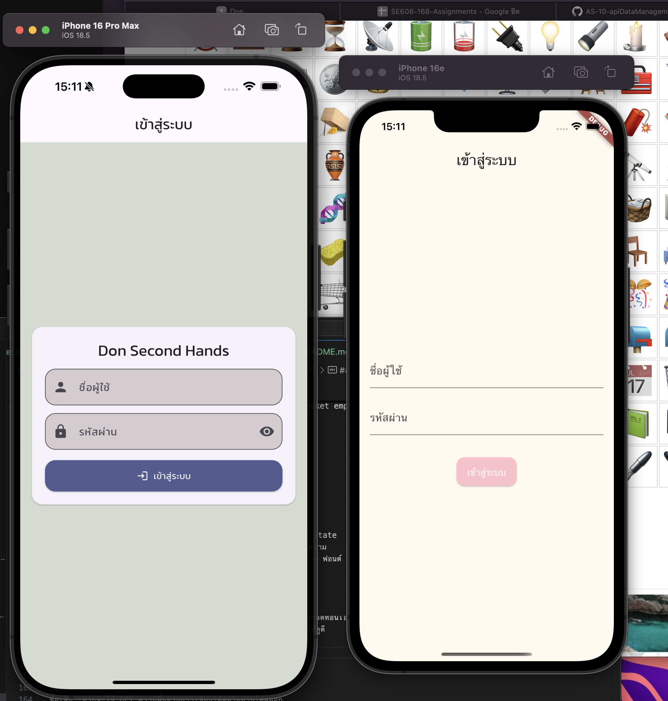
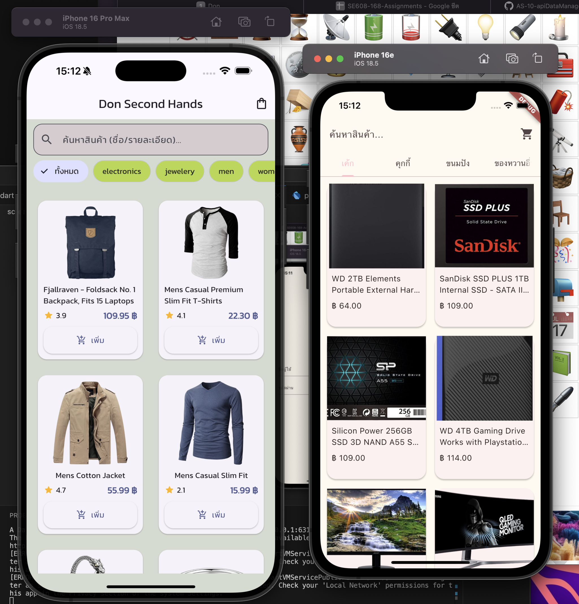

## 👨‍💻 ผู้พัฒนา
**Itthipon Khota (Don) 66543210035-2**  
Rajamangala University of Technology Lanna Doisaket (RMUTL)

## prompt 
คุณคือผู้ช่วย Flutter มืออาชีพ ช่วยสร้าง Flutter app โครงสร้างแบบแยกไฟล์ตามหน้าที่ โดยส่งเป็น "โค้ดทีละไฟล์" (ห้ามส่ง zip) ตามกติกา:
กติกาเอาต์พุต:
- ใช้โครงสร้างไฟล์แบบนี้ (สร้างเฉพาะไฟล์ที่มีโค้ด):
  lib/
    core/theme/app_theme.dart
    data/models/product.dart
    data/models/cart_item.dart
    data/services/api_service.dart
    providers/product_provider.dart
    providers/cart_provider.dart
    ui/screen/login_screen.dart (มี)
    ui/screen/home_screen.dart
    ui/screen/product_detail_screen.dart
    ui/screen/cart_screen.dart
    ui/widgets/product_card.dart
    main.dart
- ทุกไฟล์ให้ส่งใน code block แยกกัน และพิมพ์บรรทัดแรกเป็นคอมเมนต์เสมอ เช่น:
  // FILE: lib/ui/screen/home_screen.dart
  <ตามด้วยโค้ดจริง>
- โค้ดต้อง build/run ได้จริงบน Flutter 3.32+ / Dart 3.8+
- ใช้ฟอนต์ Kanit ผ่านแพ็กเกจ google_fonts
- หน้าเริ่มต้นคือ Login → เข้าหน้า Home; ยังไม่ต้องมี Logout
- รองรับ iOS/Android เป็นหลัก
สเปกแอป (ธีมร้านเบเกอรี่ + FakeStore API):
- ใช้ FakeStore API (https://fakestoreapi.com)
- โค้ด service ต้องใช้ Uri.https เพื่อเข้ารหัส category ที่มีอักขระพิเศษ
- Product model: id, title, description, price (double), image, rating(rate,count), category
- ProductProvider: โหลดสินค้าตามหมวด, ค้นหา (title/description)
- CartProvider: เพิ่ม/ลด/ลบ และคำนวณยอดรวม
- UI:
  - Home: Grid รายการสินค้า + ช่องค้นหา + แถบหมวด (รีสกินชื่อหมวดเป็น เค้ก/คุกกี้/ขนมปัง/ของหวานอื่น ๆ)
  - ProductDetail: รูป/ชื่อ/เรตติ้ง/รายละเอียด/ราคา + ปุ่มเพิ่มตะกร้า
  - Cart: แสดงรายการ, ปรับจำนวน, ยอดรวม
  - Login: ฟอร์ม username/password (mock) กดเข้าสู่ระบบแล้วไป Home
- Theme:
  - Material 3, ใช้ GoogleFonts.kanit เป็น textTheme
  - cardTheme ใช้ CardThemeData, shape = RoundedRectangleBorder(borderRadius 16)
  - สีโทนพาสเทลหวาน ๆ
ไฟล์สำคัญ:
- pubspec.yaml: เพิ่ม dependencies:
    http: ^1.2.2
    provider: ^6.1.2
    intl: ^0.19.0
    google_fonts: ^6.2.1
  (แสดงเฉพาะส่วน dependencies และ environment ก็พอ ไม่ต้องสร้างไฟล์ทั้งใบ)
- lib/core/theme/app_theme.dart: ใช้ GoogleFonts.kanitTextTheme(), CardThemeData
- lib/data/services/api_service.dart:
    static const _host = 'fakestoreapi.com';
    fetchProducts({String? category})
    fetchProduct(int id)
- หลีกเลี่ยงฟีเจอร์ที่ไม่ได้ขอ (เช่น Logout หรือระบบ Auth จริง)
หลังส่งโค้ดทั้งหมดแล้ว ให้พิมพ์ “คำสั่งรัน” ที่จำเป็น 3 บรรทัดท้าย:
1) flutter pub get
2) flutter create .
3) flutter run
เริ่มเลย: สร้างโค้ดทุกไฟล์ตามโครงที่ระบุ

# 📦 Don Second Hands (Flutter + FakeStore API) GPT 

แอปตัวอย่างร้านเบเกอรี่ที่เชื่อมต่อกับ [FakeStore API](https://fakestoreapi.com/docs)  
ใช้ **Flutter + Provider** ในการจัดการ state และ Google Fonts (Kanit) สำหรับ UI

---

## 🚀 Features
- ดึงข้อมูลสินค้าจาก FakeStore API และรีสกินเป็นเมนูเบเกอรี่ (เค้ก, คุกกี้, ขนมปัง, ของหวานอื่น ๆ)
- แสดงรายการสินค้าแบบ Grid
- ค้นหาสินค้า
- ดูรายละเอียดสินค้า
- เพิ่มสินค้าลงตะกร้า + ปรับจำนวน + ดูยอดรวม
- ใช้ **Provider** จัดการสถานะตะกร้า/สินค้า
- ใช้ธีม Kanit font + Material 3

---

## 📂 Project Structure

```
lib/
 ├─ core/
 │   └─ theme/app_theme.dart       # กำหนดธีม, ฟอนต์, สี
 ├─ data/
 │   ├─ models/                    # Product, CartItem
 │   └─ services/api_service.dart  # เรียก FakeStore API
 ├─ providers/                     # State management (ProductProvider, CartProvider)
 ├─ ui/
 │   ├─ screen/                    # หน้าจอหลัก (Home, ProductDetail, Cart)
 │   └─ widgets/                   # Widget ย่อย เช่น ProductCard
 └─ main.dart                      # Entry point
```

---

## 🛠 ติดตั้งและใช้งาน

1. **โคลนหรือแตกไฟล์ zip**
   ```bash
   cd bakery_shop_fakeapi
   ```

2. **ติดตั้ง dependencies**
   ```bash
   flutter pub get
   ```

3. **สร้าง platform files (ถ้ายังไม่มี)**
   ```bash
   flutter create .
   ```

4. **รันแอป**
   - iOS Simulator  
     ```bash
     flutter run -d ios
     ```
   - Android Emulator  
     ```bash
     flutter run -d android
     ```

---

## 📸 Screenshot (ออปชัน)
> คุณสามารถแคปหน้าจอ Home / Cart แล้วเพิ่มรูปใน README ได้ เช่น
```markdown
<p>

หน้าล็อกอิน GPT Flutter Expert ดีกว่าด้านความสวยงาม

หน้า home จะมีสินค้ารวมทั้งหมดอยู่ สามารถค้นหาสินค้าได้ที่ช่องค้นหาด้านบน
GPT มีความดูเหมือนเป็นระบบ ios และมีปุ่มเพิ่มสินค้าจาก icon ได้เลย ส่วน GROK ออกแบบเหมือนระบบ ANDRIOD 

สามารถเลือกหมวดหมู่สินค้าได้

เมื่อไปดูตะกร้าสินค้าหากไม่ได้เลือกสินค้าใส่ตระกร้าไว้ จะแสดงข้อความ basket empty

เมื่อเลือกสินค้าที่ต้องการแล้วเข้าไปดูจะพบรายละเอียดไว้สำหรับสินค้า

เมื่อเลือกสินค้าแล้วกดเพิ่มลงในตะกร้าจะพบสินค้าที่เลือกและพร้อมจ่ายเงิน 
GPT ทำปุ่มจ่ายเงินให้ แต่ GROK ไม่ทำให้
</p>
```

---

## 📦 Dependencies
- [http](https://pub.dev/packages/http) — ดึงข้อมูล API
- [provider](https://pub.dev/packages/provider) — จัดการ state
- [intl](https://pub.dev/packages/intl) — จัดรูปแบบวันที่/ข้อความ
- [google_fonts](https://pub.dev/packages/google_fonts) — ฟอนต์ Kanit

---

## 🩻 compare GPT-4o [flutter Expert] vs GROK
Grok ตอบคำถามได้กระชับกว่า GPT สามารถไล่โค้ดให้ได้แบบทั้งหมดไม่มีการลดทอนเอกสารเอกสารแบบ GPT 
แต่เรื่องความละเอียด GPT ทำได้ดีกว่าสามารถออกแบบหน้า MobileApp ให้ดูดี 

## ข้อดีข้อเสียของ Machine Learning ทั้ง 2 ตัว

**GPT**
ข้อดี : ให้โค้ดกระชับกว่า
<br>
ข้อเสีย :หากจะใช้ GPT ควรมีพื้นฐานการเขียนโค้ดหรืออ่านโค้ดออก

**GROK**
ข้อดี : ตอบโค้ดยาวๆให้เลย
<br>
ข้อเสีย : งานไม่ค่อยละเอียด

**สรุป**
สำหรับผม GPT มีความฉลาดกว่าสามารถทำงานได้หลายรูปแบบเข้าใจคำถามที่ผมถามง่าย
GROK บางทีก็มั่วหรือตอบไม่ค่อยตรงตามความเป็นจริงต้องอธิบายอย่างละเอียดแบบเจาะลึกไม่เหมือน GPT
-